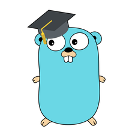

# Программирование на Golang

[Программирование на Golang](https://stepik.org/course/54403/promo "Ссылка на курс").

Курс посвящен основам языка программирования Golang. Курс будет полезен тем, кто уже имеет базовый опыт в программировании. На курсе будет рассмотрена теория, подкрепленная практикой.

## О курсе
В этом курсе по программированию на языке Golang (Go) вы познакомитесь с основными возможностями этого языка. Например, циклы, срезы, горутины, работа с JSON и многое другое. Нельзя научиться программировать без практики, поэтому вам будет предложено довольно много задач разного уровня, в которых вы сможете потренировать своё умение программировать. Ваши решения будут проверяться автоматической системой, поэтому вы будете получать быструю обратную связь. Преподаватели постараются отвечать на любые вопросы в комментариях, поэтому если у вас будут возникать проблемы, то их всегда можно обсудить с преподавателями и однокурсниками в комментариях к задачам.

## Начальные требования
Курс подходит тем, кто имеет знания о базовом программировании. Курс не предполагает каких-либо специальных знаний по информатике, но для понимания курса желательно знать основы одного из языков программирования и уметь достаточно свободно пользоваться компьютером.